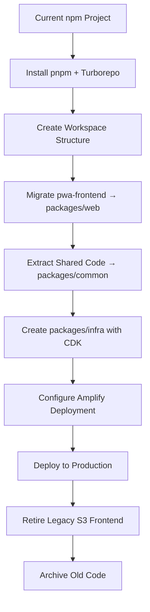

# Design Document: Monorepo Migration

## Overview

This design specifies the migration of the a10dit event check-in system from a single npm-based project to a modern monorepo architecture using pnpm and Turborepo. The migration will restructure the codebase into three packages (web, common, infra), deploy the new PWA frontend via AWS Amplify, and retire the legacy S3-based frontend deployment while maintaining zero downtime and backward compatibility.

The migration follows gdna monorepo standards exactly, ensuring strict dependency isolation, efficient build orchestration, and proper infrastructure as code practices.

## Architecture

### Current State

```
a10dit-app/
├── frontend/              # Legacy vanilla HTML/CSS/JS (S3 deployed)
├── pwa-frontend/          # New Vite + React + TypeScript (not deployed)
├── src/handlers/          # Lambda functions
├── src/utils/             # Shared utilities
├── serverless.yml         # Infrastructure definition
└── package.json           # npm-based dependencies
```

### Target State

```
a10dit-app/
├── packages/
│   ├── web/              # PWA frontend (Amplify deployed)
│   │   ├── src/
│   │   ├── package.json
│   │   ├── vite.config.ts
│   │   └── tsconfig.json
│   ├── common/           # Shared types and validators
│   │   ├── src/
│   │   │   ├── types/
│   │   │   ├── validators/
│   │   │   └── index.ts
│   │   ├── package.json
│   │   └── tsconfig.json
│   └── infra/            # AWS CDK infrastructure
│       ├── bin/
│       ├── lib/
│       │   ├── stacks/
│       │   └── constructs/
│       ├── package.json
│       └── tsconfig.json
├── archive/
│   └── frontend/         # Archived legacy frontend
├── pnpm-workspace.yaml
├── turbo.json
├── tsconfig.base.json
├── amplify.yml
├── .npmrc
└── pnpm-lock.yaml
```

### Migration Flow



## Components and Interfaces

### Package: common

**Purpose:** Shared TypeScript types and Zod validators used by both frontend and backend.

**Exports:**
```typescript
// packages/common/src/types/index.ts
export interface Attendee {
  attendeeId: string;
  eventId: string;
  name: string;
  email: string;
  company?: string;
  wantsToPresent: boolean;
  productOrigin?: string;
  checkedInAt: string;
}

export interface Event {
  eventId: string;
  organizerId: string;
  name: string;
  date: string;
  location: string;
  description?: string;
  isActive: boolean;
  slug: string;
  coOrganizers?: string[];
  customDomain?: string;
}

export interface PresenterQueueEntry {
  queueId: string;
  eventId: string;
  attendeeId: string;
  attendeeName: string;
  timestamp: string;
  status: 'waiting' | 'presenting' | 'completed';
}

export interface Organizer {
  organizerId: string;
  email: string;
  name: string;
  organization?: string;
  status: 'pending' | 'approved' | 'rejected';
  slug: string;
  customDomain?: string;
  subscriptionStatus?: 'active' | 'inactive' | 'trial';
}

// packages/common/src/validators/index.ts
import { z } from 'zod';

export const checkInSchema = z.object({
  eventId: z.string().min(1),
  name: z.string().min(1).max(100),
  email: z.string().email(),
  company: z.string().max(100).optional(),
  wantsToPresent: z.boolean(),
  productOrigin: z.string().max(50).optional(),
});

export type CheckInInput = z.infer<typeof checkInSchema>;

export const createEventSchema = z.object({
  name: z.string().min(1).max(200),
  date: z.string().datetime(),
  location: z.string().min(1).max(200),
  description: z.string().max(1000).optional(),
  slug: z.string().min(3).max(50).regex(/^[a-z0-9-]+$/),
});

export type CreateEventInput = z.infer<typeof createEventSchema>;

export const updatePresenterStatusSchema = z.object({
  status: z.enum(['waiting', 'presenting', 'completed']),
});

export type UpdatePresenterStatusInput = z.infer<typeof updatePresenterStatusSchema>;
```

**Package Configuration:**
```json
{
  "name": "common",
  "version": "0.0.0",
  "private": true,
  "main": "dist/index.js",
  "types": "dist/index.d.ts",
  "scripts": {
    "build": "tsc",
    "typecheck": "tsc --noEmit"
  },
  "dependencies": {
    "zod": "^4.3.6"
  },
  "devDependencies": {
    "typescript": "~5.9.3"
  }
}
```

### Package: web

**Purpose:** PWA frontend application (migrated from pwa-frontend).

**Key Changes:**
- Import shared types: `import { Attendee, Event } from 'common'`
- Import shared validators: `import { checkInSchema } from 'common'`
- Update API client to use shared types
- Configure workspace dependency: `"common": "workspace:*"`

**Package Configuration:**
```json
{
  "name": "web",
  "version": "0.0.0",
  "private": true,
  "type": "module",
  "scripts": {
    "dev": "vite",
    "build": "tsc -b && vite build",
    "lint": "eslint .",
    "typecheck": "tsc --noEmit",
    "test": "vitest",
    "preview": "vite preview"
  },
  "dependencies": {
    "common": "workspace:*",
    "@hookform/resolvers": "^5.2.2",
    "@radix-ui/react-avatar": "^1.1.11",
    "@tanstack/react-query": "^5.90.21",
    "aws-amplify": "^6.16.2",
    "react": "^19.2.0",
    "react-dom": "^19.2.0",
    "react-router-dom": "^7.13.0",
    "zod": "^4.3.6",
    "zustand": "^5.0.11"
  },
  "devDependencies": {
    "@vitejs/plugin-react": "^5.1.4",
    "typescript": "~5.9.3",
    "vite": "^7.3.1",
    "vitest": "^4.0.18"
  }
}
```

**TypeScript Configuration:**
```json
{
  "extends": "../../tsconfig.base.json",
  "compilerOptions": {
    "outDir": "dist",
    "rootDir": "src",
    "jsx": "react-jsx",
    "lib": ["ES2020", "DOM", "DOM.Iterable"]
  },
  "include": ["src"],
  "references": [{ "path": "../common" }]
}
```

### Package: infra

**Purpose:** AWS CDK infrastructure as code.

**Stack Organization:**
```typescript
// packages/infra/bin/app.ts
import * as cdk from 'aws-cdk-lib';
import { DataStack } from '../lib/stacks/data-stack';
import { ComputeStack } from '../lib/stacks/compute-stack';
import { HostingStack } from '../lib/stacks/hosting-stack';

const app = new cdk.App();

// Tagging per gdna standards
cdk.Tags.of(app).add('gdna:project', 'a10dit');
cdk.Tags.of(app).add('gdna:environment', process.env.STAGE || 'dev');
cdk.Tags.of(app).add('gdna:owner', 'platform-team');
cdk.Tags.of(app).add('gdna:cost-center', 'engineering');

const dataStack = new DataStack(app, 'A10ditDataStack', {
  env: { region: 'us-east-1', account: '730335467631' },
});

const computeStack = new ComputeStack(app, 'A10ditComputeStack', {
  env: { region: 'us-east-1', account: '730335467631' },
  tables: dataStack.tables,
  qrBucket: dataStack.qrBucket,
});

const hostingStack = new HostingStack(app, 'A10ditHostingStack', {
  env: { region: 'us-east-1', account: '730335467631' },
  apiUrl: computeStack.apiUrl,
});
```

**Data Stack:**
```typescript
// packages/infra/lib/stacks/data-stack.ts
import * as cdk from 'aws-cdk-lib';
import * as dynamodb from 'aws-cdk-lib/aws-dynamodb';
import * as s3 from 'aws-cdk-lib/aws-s3';
import { Construct } from 'constructs';

export class DataStack extends cdk.Stack {
  public readonly tables: {
    attendees: dynamodb.Table;
    presenterQueue: dynamodb.Table;
    events: dynamodb.Table;
    organizers: dynamodb.Table;
    waitlist: dynamodb.Table;
    invitations: dynamodb.Table;
  };
  public readonly qrBucket: s3.Bucket;

  constructor(scope: Construct, id: string, props?: cdk.StackProps) {
    super(scope, id, props);

    // Attendees Table
    this.tables.attendees = new dynamodb.Table(this, 'AttendeesTable', {
      partitionKey: { name: 'attendeeId', type: dynamodb.AttributeType.STRING },
      billingMode: dynamodb.BillingMode.PAY_PER_REQUEST,
      removalPolicy: cdk.RemovalPolicy.RETAIN,
      pointInTimeRecovery: true,
    });
    this.tables.attendees.addGlobalSecondaryIndex({
      indexName: 'eventId-index',
      partitionKey: { name: 'eventId', type: dynamodb.AttributeType.STRING },
    });

    // Presenter Queue Table
    this.tables.presenterQueue = new dynamodb.Table(this, 'PresenterQueueTable', {
      partitionKey: { name: 'queueId', type: dynamodb.AttributeType.STRING },
      billingMode: dynamodb.BillingMode.PAY_PER_REQUEST,
      removalPolicy: cdk.RemovalPolicy.RETAIN,
      pointInTimeRecovery: true,
    });
    this.tables.presenterQueue.addGlobalSecondaryIndex({
      indexName: 'eventId-timestamp-index',
      partitionKey: { name: 'eventId', type: dynamodb.AttributeType.STRING },
      sortKey: { name: 'timestamp', type: dynamodb.AttributeType.STRING },
    });

    // Events Table
    this.tables.events = new dynamodb.Table(this, 'EventsTable', {
      partitionKey: { name: 'eventId', type: dynamodb.AttributeType.STRING },
      billingMode: dynamodb.BillingMode.PAY_PER_REQUEST,
      removalPolicy: cdk.RemovalPolicy.RETAIN,
      pointInTimeRecovery: true,
    });
    this.tables.events.addGlobalSecondaryIndex({
      indexName: 'organizerId-index',
      partitionKey: { name: 'organizerId', type: dynamodb.AttributeType.STRING },
    });
    this.tables.events.addGlobalSecondaryIndex({
      indexName: 'slug-index',
      partitionKey: { name: 'slug', type: dynamodb.AttributeType.STRING },
    });

    // Organizers Table
    this.tables.organizers = new dynamodb.Table(this, 'OrganizersTable', {
      partitionKey: { name: 'organizerId', type: dynamodb.AttributeType.STRING },
      billingMode: dynamodb.BillingMode.PAY_PER_REQUEST,
      removalPolicy: cdk.RemovalPolicy.RETAIN,
      pointInTimeRecovery: true,
    });
    this.tables.organizers.addGlobalSecondaryIndex({
      indexName: 'email-index',
      partitionKey: { name: 'email', type: dynamodb.AttributeType.STRING },
    });
    this.tables.organizers.addGlobalSecondaryIndex({
      indexName: 'slug-index',
      partitionKey: { name: 'slug', type: dynamodb.AttributeType.STRING },
    });

    // Waitlist Table
    this.tables.waitlist = new dynamodb.Table(this, 'WaitlistTable', {
      partitionKey: { name: 'email', type: dynamodb.AttributeType.STRING },
      billingMode: dynamodb.BillingMode.PAY_PER_REQUEST,
      removalPolicy: cdk.RemovalPolicy.RETAIN,
    });

    // Invitations Table
    this.tables.invitations = new dynamodb.Table(this, 'InvitationsTable', {
      partitionKey: { name: 'invitationId', type: dynamodb.AttributeType.STRING },
      billingMode: dynamodb.BillingMode.PAY_PER_REQUEST,
      removalPolicy: cdk.RemovalPolicy.RETAIN,
    });
    this.tables.invitations.addGlobalSecondaryIndex({
      indexName: 'email-index',
      partitionKey: { name: 'email', type: dynamodb.AttributeType.STRING },
    });

    // QR Code Bucket
    this.qrBucket = new s3.Bucket(this, 'QRCodeBucket', {
      encryption: s3.BucketEncryption.S3_MANAGED,
      blockPublicAccess: s3.BlockPublicAccess.BLOCK_ALL,
      enforceSSL: true,
      versioned: true,
      removalPolicy: cdk.RemovalPolicy.RETAIN,
    });
  }
}
```

**Hosting Stack:**
```typescript
// packages/infra/lib/stacks/hosting-stack.ts
import * as cdk from 'aws-cdk-lib';
import * as amplify from 'aws-cdk-lib/aws-amplify';
import { Construct } from 'constructs';

export interface HostingStackProps extends cdk.StackProps {
  apiUrl: string;
}

export class HostingStack extends cdk.Stack {
  constructor(scope: Construct, id: string, props: HostingStackProps) {
    super(scope, id, props);

    const amplifyApp = new amplify.CfnApp(this, 'A10ditAmplifyApp', {
      name: 'a10dit-pwa',
      repository: 'https://github.com/your-org/a10dit-app',
      accessToken: cdk.SecretValue.secretsManager('github-token').toString(),
      buildSpec: `
version: 1
applications:
  - appRoot: packages/web
    frontend:
      phases:
        preBuild:
          commands:
            - npm install -g pnpm
            - cd ../.. && pnpm install --frozen-lockfile
            - pnpm turbo build --filter=common
        build:
          commands:
            - pnpm turbo build --filter=web
      artifacts:
        baseDirectory: dist
        files:
          - '**/*'
      cache:
        paths:
          - ../../node_modules/.pnpm/**/*
          - node_modules/**/*
      `,
      environmentVariables: [
        { name: 'VITE_API_URL', value: props.apiUrl },
        { name: 'VITE_COGNITO_USER_POOL_ID', value: process.env.COGNITO_USER_POOL_ID || '' },
        { name: 'VITE_COGNITO_CLIENT_ID', value: process.env.COGNITO_CLIENT_ID || '' },
      ],
    });

    const mainBranch = new amplify.CfnBranch(this, 'MainBranch', {
      appId: amplifyApp.attrAppId,
      branchName: 'main',
      enableAutoBuild: true,
      stage: 'PRODUCTION',
    });

    new amplify.CfnDomain(this, 'CustomDomain', {
      appId: amplifyApp.attrAppId,
      domainName: 'a10dit.com',
      subDomainSettings: [
        {
          branchName: mainBranch.branchName,
          prefix: '',
        },
      ],
    });
  }
}
```

**Package Configuration:**
```json
{
  "name": "infra",
  "version": "0.0.0",
  "private": true,
  "scripts": {
    "build": "tsc",
    "cdk:synth": "cdk synth",
    "cdk:deploy": "cdk deploy --all",
    "cdk:diff": "cdk diff",
    "typecheck": "tsc --noEmit",
    "test": "jest"
  },
  "dependencies": {
    "common": "workspace:*",
    "aws-cdk-lib": "^2.100.0",
    "constructs": "^10.0.0"
  },
  "devDependencies": {
    "@types/jest": "^30.0.0",
    "@types/node": "^24.10.1",
    "aws-cdk": "^2.100.0",
    "jest": "^30.2.0",
    "typescript": "~5.9.3"
  }
}
```

## Data Models

### Workspace Configuration

**pnpm-workspace.yaml:**
```yaml
packages:
  - 'packages/*'
```

**turbo.json:**
```json
{
  "$schema": "https://turbo.build/schema.json",
  "pipeline": {
    "build": {
      "dependsOn": ["^build"],
      "outputs": ["dist/**", ".next/**", "cdk.out/**"]
    },
    "dev": {
      "cache": false,
      "persistent": true
    },
    "test": {
      "dependsOn": ["^build"]
    },
    "lint": {},
    "typecheck": {
      "dependsOn": ["^build"]
    },
    "cdk:synth": {
      "dependsOn": ["^build"],
      "outputs": ["cdk.out/**"]
    },
    "cdk:deploy": {
      "dependsOn": ["cdk:synth"],
      "cache": false
    }
  }
}
```

**tsconfig.base.json:**
```json
{
  "compilerOptions": {
    "strict": true,
    "noUncheckedIndexedAccess": true,
    "noImplicitReturns": true,
    "noFallthroughCasesInSwitch": true,
    "forceConsistentCasingInFileNames": true,
    "exactOptionalPropertyTypes": true,
    "target": "ES2022",
    "module": "ESNext",
    "moduleResolution": "bundler",
    "esModuleInterop": true,
    "skipLibCheck": true,
    "declaration": true,
    "declarationMap": true,
    "sourceMap": true,
    "composite": true
  }
}
```

**.npmrc:**
```ini
auto-install-peers=true
strict-peer-dependencies=false
shamefully-hoist=false
```

**amplify.yml:**
```yaml
version: 1
applications:
  - appRoot: packages/web
    frontend:
      phases:
        preBuild:
          commands:
            - npm install -g pnpm
            - cd ../.. && pnpm install --frozen-lockfile
            - pnpm turbo build --filter=common
        build:
          commands:
            - pnpm turbo build --filter=web
      artifacts:
        baseDirectory: dist
        files:
          - '**/*'
      cache:
        paths:
          - ../../node_modules/.pnpm/**/*
          - node_modules/**/*
```

## Correctness Properties

*A property is a characteristic or behavior that should hold true across all valid executions of a system—essentially, a formal statement about what the system should do. Properties serve as the bridge between human-readable specifications and machine-verifiable correctness guarantees.*


### Property 1: Workspace Import Consistency

*For any* source file in packages/web or packages/infra that imports from the common package, the import statement should use the workspace package name `'common'` and not relative paths like `'../../common'`.

**Validates: Requirements 2.4, 2.5, 4.6**

### Property 2: CDK Construct Level Preference

*For any* CDK resource definition in packages/infra, when an L2 or L3 construct is available for that resource type, the code should use the L2/L3 construct (e.g., `dynamodb.Table`) rather than the L1 CloudFormation primitive (e.g., `CfnTable`).

**Validates: Requirements 5.5**

### Property 3: API Endpoint Backward Compatibility

*For any* API endpoint that existed before the migration, making a request to that endpoint after migration should return a response with the same structure and behavior as before the migration.

**Validates: Requirements 10.3**

## Error Handling

### Migration Errors

**Package Structure Errors:**
- If pnpm-lock.yaml is missing, fail with: "pnpm-lock.yaml not found. Run 'pnpm install' to generate it."
- If package-lock.json exists, fail with: "package-lock.json detected. This project uses pnpm. Delete package-lock.json and run 'pnpm install'."
- If shamefully-hoist is not set to false in .npmrc, fail with: ".npmrc must set shamefully-hoist=false for strict dependency isolation."

**Build Errors:**
- If common package fails to build, fail with: "packages/common build failed. Fix errors before building dependent packages."
- If workspace dependency resolution fails, fail with: "Workspace dependency resolution failed. Ensure all workspace:* dependencies are valid."
- If TypeScript compilation fails, fail with: "TypeScript compilation failed in [package]. Check tsconfig.json extends ../../tsconfig.base.json."

**Deployment Errors:**
- If Amplify build fails, fail with: "Amplify build failed. Check amplify.yml configuration and build logs."
- If CDK synthesis fails, fail with: "CDK synthesis failed. Run 'pnpm turbo cdk:synth --filter=infra' locally to debug."
- If DNS cutover fails, fail with: "DNS cutover failed. Rollback to previous configuration."

### Rollback Strategy

**If Amplify deployment fails:**
1. Keep legacy S3 frontend serving traffic
2. Debug Amplify build logs
3. Fix issues and retry deployment
4. Only cutover DNS when Amplify deployment is verified working

**If API compatibility breaks:**
1. Immediately rollback to previous Lambda deployment
2. Investigate breaking changes
3. Fix compatibility issues
4. Redeploy with backward compatibility verified

**If CDK deployment fails:**
1. CDK will automatically rollback stack changes
2. Review CloudFormation events for failure reason
3. Fix CDK code issues
4. Redeploy with `cdk deploy --all`

## Testing Strategy

### Unit Tests

**packages/common:**
- Test Zod schema validation with valid and invalid inputs
- Test type exports are accessible
- Test schema inference produces correct TypeScript types

**packages/web:**
- Test React components render correctly
- Test form validation uses common schemas
- Test API client uses common types
- Test routing and navigation

**packages/infra:**
- Snapshot tests for each CDK stack
- Fine-grained assertions for security-critical resources (S3 bucket policies, IAM roles)
- Validation tests for construct input constraints

### Property-Based Tests

**Property 1: Workspace Import Consistency**
- Generate random source files from web and infra packages
- Parse import statements
- Verify all imports from common use `'common'` not relative paths
- Run 100 iterations across different source files

**Property 2: CDK Construct Level Preference**
- Parse all CDK stack files
- Extract resource definitions
- For each resource, check if L2/L3 construct is used
- Verify no L1 constructs (Cfn*) are used when L2/L3 available
- Run across all stack files

**Property 3: API Endpoint Backward Compatibility**
- Generate test requests for all existing API endpoints
- Send requests to both old and new deployments
- Compare response structures and status codes
- Verify responses are equivalent
- Run 100 iterations with varied request parameters

### Integration Tests

**Monorepo Build Pipeline:**
- Run `pnpm turbo build` and verify all packages build successfully
- Verify build order: common builds before web and infra
- Verify dist/ directories are created in each package
- Verify no build errors or warnings

**Amplify Deployment:**
- Trigger Amplify build via git push
- Monitor build logs for errors
- Verify build artifacts are generated
- Verify deployment succeeds
- Verify custom domain resolves correctly

**End-to-End Smoke Tests:**
- Test check-in flow: submit check-in form, verify attendee created
- Test presenter queue: join queue, verify entry appears
- Test organizer dashboard: login, view events, view attendees
- Test QR code generation: generate QR, verify image created
- Run tests against both staging and production

### Migration Validation Checklist

**Pre-Migration:**
- [ ] Backup all DynamoDB tables
- [ ] Document current S3/CloudFront configuration
- [ ] Verify all tests pass in current system
- [ ] Create rollback plan document

**During Migration:**
- [ ] Verify pnpm-lock.yaml is committed
- [ ] Verify all packages build successfully
- [ ] Verify CDK synthesis succeeds
- [ ] Verify Amplify build succeeds
- [ ] Run smoke tests against Amplify preview deployment

**Post-Migration:**
- [ ] Verify DNS resolves to Amplify
- [ ] Run full end-to-end test suite
- [ ] Monitor error rates and response times
- [ ] Verify all existing functionality works
- [ ] Archive legacy frontend
- [ ] Disable S3 static website hosting
- [ ] Update documentation

### Test Configuration

**Vitest (packages/web and packages/common):**
```typescript
// vitest.config.ts
export default defineConfig({
  test: {
    environment: 'jsdom',
    globals: true,
    coverage: {
      provider: 'v8',
      reporter: ['text', 'lcov'],
      thresholds: {
        statements: 80,
        branches: 75,
        functions: 80,
        lines: 80,
      },
    },
    reporters: ['default'],
    silent: true,
  },
});
```

**Jest (packages/infra):**
```javascript
// jest.config.js
module.exports = {
  testEnvironment: 'node',
  roots: ['<rootDir>/test'],
  testMatch: ['**/*.test.ts'],
  transform: {
    '^.+\\.tsx?$': 'ts-jest'
  },
  coverageThreshold: {
    global: {
      statements: 90,
      branches: 85,
      functions: 90,
      lines: 90,
    },
  },
};
```

**Property Test Tags:**
Each property test must include a comment tag:
```typescript
// Feature: monorepo-migration, Property 1: Workspace Import Consistency
test('all imports from common use workspace package name', async () => {
  // property test implementation
});
```

## Performance Considerations

### Build Performance

**Turborepo Caching:**
- First build: ~2-3 minutes (all packages)
- Cached build: ~5-10 seconds (no changes)
- Incremental build: ~30-60 seconds (common changed)

**Amplify Build Times:**
- Cold build: ~3-5 minutes (install + build)
- Warm build: ~2-3 minutes (cached dependencies)

### Runtime Performance

**Frontend Bundle Size:**
- Target: < 200KB initial JS (gzipped)
- Current pwa-frontend: ~180KB (within budget)
- No expected increase from monorepo migration

**API Response Times:**
- No change expected (backend unchanged)
- Monitor for regressions during migration

### Optimization Strategies

**pnpm:**
- Use `--frozen-lockfile` in CI to prevent dependency drift
- Use `--filter` to build only changed packages
- Leverage pnpm's hard-link strategy for disk efficiency

**Turborepo:**
- Enable remote caching for CI/CD (optional)
- Use `--force` flag to bypass cache when needed
- Monitor cache hit rates

**Amplify:**
- Cache node_modules between builds
- Use pnpm's efficient dependency resolution
- Minimize build steps in amplify.yml

## Security Considerations

### Dependency Security

**pnpm Audit:**
- Run `pnpm audit` in CI pipeline
- Fail build on high/critical vulnerabilities
- Use `pnpm audit --fix` to auto-update vulnerable dependencies

**Lockfile Integrity:**
- Always commit pnpm-lock.yaml
- Never commit package-lock.json or yarn.lock
- Verify lockfile integrity in CI with `--frozen-lockfile`

### Infrastructure Security

**CDK Security:**
- Use cdk-nag for automated security checks
- Enforce encryption at rest for all data stores
- Block public access on all S3 buckets
- Use least-privilege IAM policies

**Amplify Security:**
- Store secrets in AWS Secrets Manager
- Use environment variables for configuration
- Never commit .env files with real values
- Enable HTTPS-only access

### Access Control

**Repository Access:**
- Require PR reviews before merge
- Protect main branch from direct pushes
- Use branch protection rules

**AWS Access:**
- Use IAM roles for Amplify builds
- Limit CDK deployment permissions
- Enable CloudTrail for audit logging

## Migration Timeline

### Phase 1: Setup (Day 1)
- Install pnpm and Turborepo
- Create workspace structure
- Create base configuration files
- Verify pnpm install works

### Phase 2: Package Migration (Day 2-3)
- Move pwa-frontend to packages/web
- Extract shared code to packages/common
- Update imports to use workspace dependencies
- Verify builds work locally

### Phase 3: Infrastructure as Code (Day 4-5)
- Create packages/infra with CDK
- Define data stack (DynamoDB, S3)
- Define compute stack (Lambda, API Gateway)
- Define hosting stack (Amplify)
- Verify CDK synthesis works

### Phase 4: Amplify Setup (Day 6)
- Create amplify.yml
- Configure Amplify app in AWS Console
- Set up environment variables
- Test build in Amplify

### Phase 5: Testing (Day 7)
- Run all unit tests
- Run integration tests
- Run end-to-end smoke tests
- Verify all functionality works

### Phase 6: Deployment (Day 8)
- Deploy Amplify to production
- Monitor build and deployment
- Verify DNS resolution
- Run smoke tests against production

### Phase 7: Cleanup (Day 9)
- Archive legacy frontend
- Disable S3 static website hosting
- Update documentation
- Create migration log

### Phase 8: Monitoring (Day 10+)
- Monitor error rates
- Monitor response times
- Verify no regressions
- Address any issues

## Success Criteria

The migration is considered successful when:

1. All packages build successfully with `pnpm turbo build`
2. All tests pass with `pnpm turbo test`
3. CDK synthesis succeeds with `pnpm turbo cdk:synth --filter=infra`
4. Amplify deploys successfully to production
5. Custom domain (a10dit.com) resolves to Amplify deployment
6. All existing functionality works in new deployment
7. End-to-end smoke tests pass
8. No increase in error rates or response times
9. Legacy frontend is archived
10. Documentation is updated

## References

- [gdna Monorepo Standards](../../steering/monorepo-standards.md)
- [gdna TypeScript Standards](../../steering/typescript-standards.md)
- [gdna AWS CDK Standards](../../steering/aws-cdk-standards.md)
- [pnpm Documentation](https://pnpm.io/)
- [Turborepo Documentation](https://turbo.build/)
- [AWS Amplify Documentation](https://docs.amplify.aws/)
- [AWS CDK Documentation](https://docs.aws.amazon.com/cdk/)
